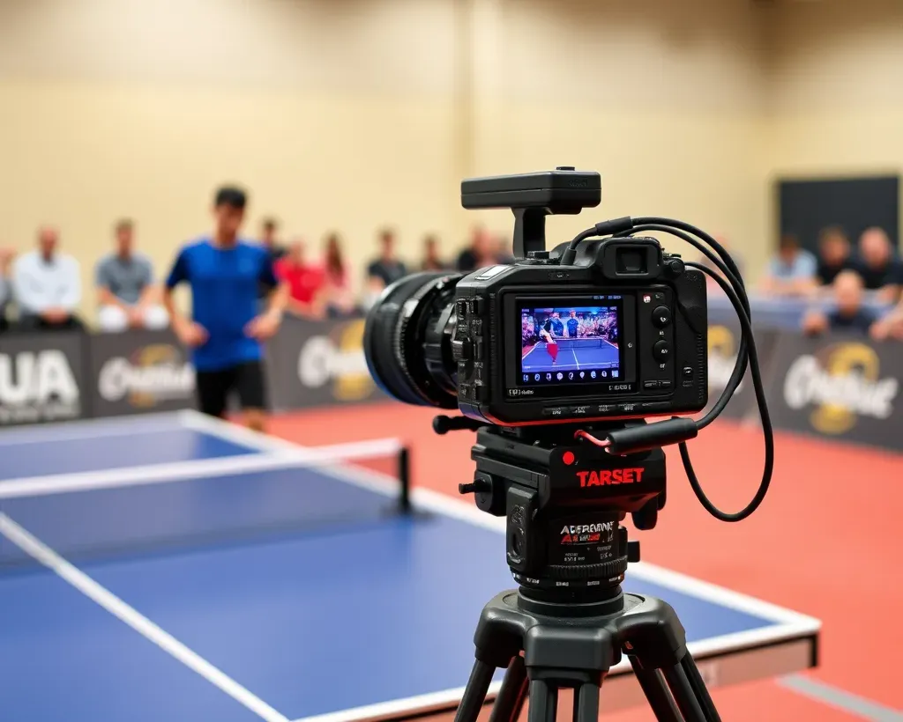
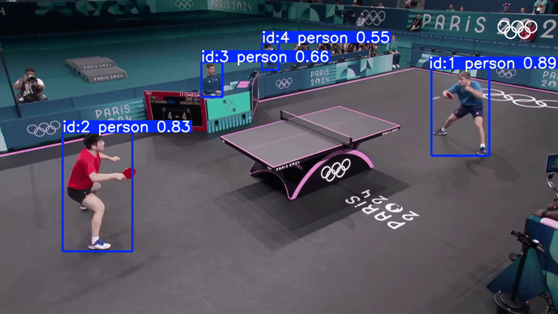
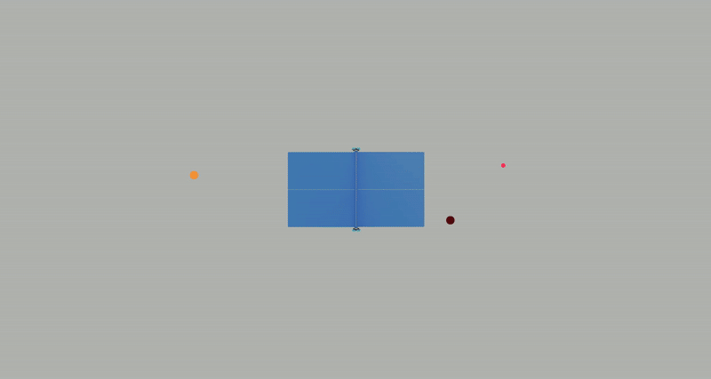

# Table Tennis Tracker
<div align="left" style="padding-left: 0px;">
    
</div>

Ping Pong Tracker is a comprehensive video analysis tool designed to analyze table tennis matches. It leverages state-of-the-art computer vision and deep learning techniques to track the ball, detect human players, and segment the table.

---

## Overview

**Ping Pong Tracker** offers the following key features:

- **Ball Tracking:**  
Detects and tracks the ball using a combination of RT-DETR for object detection and SAM-based segmentation and tracking. This robust pipeline ensures that even when the ball gains height (as during a serve), it's location is correctly determined relative to the global coordiantes.
  <div align="left" style="padding-left: 50px;">
      
  </div>

- **Human Tracking:**  
Utilizes YOLO-based detection with ByteTrack to identify and track players throughout the video, allowing analysis of their positions relative to the table.
  <div align="left" style="padding-left: 50px;">
      
  </div>

- **Table Detection & Tracking:**  
Implements table segmentation using YOLO and SAM, followed by robust corner tracking with feature-based RANSAC homography. This ensures reliable transformation from the video’s perspective to a bird’s-eye view of the table. Even when the table moves, chaining ORB descriptors allows for tracking across frames.
  <div align="left" style="padding-left: 50px;">
      
  </div>

- **Mini Table Generation:**  
Generates a mini table view video that overlays the tracked ball and human positions on a corrected, perspective-transformed image of the table.
  <div align="left" style="padding-left: 50px;">
      
  </div>

---

## Assumptions & Video Requirements

For optimal performance and accurate tracking, ensure that your input videos meet the following conditions:

- **Ball Color:**  
  The ball must be near white (this color is adjustable).

- **Table Corners Visibility:**  
  The table corners must be visible within the first 7 seconds of the video (this duration is adjustable).

- **Video Speed:**  
  No slow motion shots are allowed, ensuring accurate ball detections.

- **Camera Perspective:**  
  There should be no changes in camera perspective (e.g., shooting from different angles or zooming in/out).

- **Table Frame Presence:**  
  The table ideally should always remain fully visible within the video frame.

- **Match Format:**  
  Only two-player matches are supported.

- **Net Components:**  
  For accurate table detection, any part of the net components should not match the main color of the table.

---

## Directory Structure

```plaintext
.
├── src
│   ├── BallTracker.py       # Ball detection and tracking module
│   ├── HumanTracker.py      # Human player detection and tracking module
│   ├── MiniTable.py         # Mini table video generation. Runs ball, human, and table tracker to achieve a top-down view 
│   └── TableTracker.py      # Table detection and corner tracking
├── utils
│   ├── __init__.py
│   └── helpers.py           # Helper functions for frame extraction, visualization, etc.
└── setup.py                 # Setup script for installation
```

## Technologies Used

+ [Python](https://www.python.org/) – Primary programming language.
+ [OpenCV](https://opencv.org/) – Image and video processing.
+ [PyTorch](https://pytorch.org/) – Deep learning framework for model inference.
+ [YOLO (Ultralytics)](https://github.com/ultralytics/yolov5) – Real-time object detection.
+ [SAM2 (Segment Anything Model 2)](https://github.com/facebookresearch/sam2) – Advanced segmentation for accurate mask extraction and ball tracking.
+ [FFmpeg](https://ffmpeg.org/) – For video frame extraction and processing.
+ [Matplotlib](https://matplotlib.org/) – Visualization of detection and segmentation results.
+ [Pandas](https://pandas.pydata.org/) & [NumPy](https://numpy.org/) – Data handling and numerical operations.
+ [DETR (Detection Transformer)](https://github.com/facebookresearch/detr) – Initial ball detection for robust tracking.

---

## Installation

### Setup Steps

1. **Clone the Repository:**

   ```bash
   git clone https://github.com/yourusername/pingpong.git
   cd pingpong
   ```

2. **Create and Activate a Virtual Environment:**

   Using Conda:
   ```bash
   conda create -n pingpong_env python=3.9 -y
   conda activate pingpong_env
   ```

3. **Install Dependencies:**

    - **Install required packages via `pip`:**
      ```bash
      pip install -r requirements.txt
      ```
      *Alternatively, you can install via the setup script:*
      ```bash
      python setup.py install -e .
      ```

    - **Install SAM2.1:**
    Follow the installation instructions at the [SAM2 repository](https://github.com/facebookresearch/sam2).
      ```
---

## Usage

### Table Detection & Tracking

Detect and track the table’s corners across video frames using YOLO and SAM, with optional output video visualization:
```bash
python src/TableTracker.py
```

### Ball Tracking

Extract frames from a video, detect the ball, and perform a perspective transformation to map the ball’s trajectory correctly onto the table:
```bash
python src/BallTracker.py
```

### Human Tracking

Run the human tracking module to detect and track players:
```bash
python src/HumanTracker.py
```

### Mini Table Video Generation

Generate a mini table view with overlaid ball and player positions:
```bash
python src/MiniTable.py
```

---

## Acknowledgements

A special thanks to [Omar Eldahshoury](https://github.com/omareldahshoury).

---

## License

This project is licensed under the MIT License. See the [LICENSE](LICENSE) file for more details.